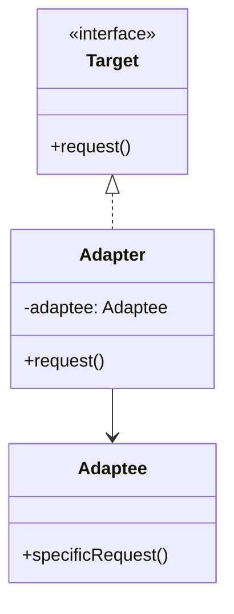

## 适配器模式

适配器模式是一种结构型设计模式，通过创建一个适配器类，将一个接口转换成客户端所期望的另一个接口。

换句话说，就是两个东西原本的接口并不匹配，但又想让它们协作的时候，就可以通过 “适配器” 做中间桥梁。

就好比现在很多手机都没有 3.5mm 耳机插孔，但是如果我们想要用的话，就需要一个转接器，这就是适配器模式的思想。

## 为什么要使用适配器模式？

适配器模式的目的是为了应对不同类或系统接口不兼容的问题。在开发过程中，我们经常会遇到需要与已有系统或第三方库进行交互的情况。如果这些系统的接口和我们自己的系统不兼容，直接进行交互会很困难，这时就可以使用适配器模式，通过创建一个适配器，我们能够将第三方库或旧系统的接口转换为自己需要的接口，从而避免了大规模修改现有代码的复杂性和不必要的风险。适配器模式使得代码更加灵活，能够平滑过渡到不同的技术栈和系统，同时还可以在不改变客户端代码的前提下，扩展和引入新的功能。

## 适配器模式的应用场景

- 旧系统与新系统对接：在企业应用中，许多老应用接口不符合现代需求（例如，返回的数据格式不同，方法签名不匹配等），通过适配器模式可以将新系统所需的接口转换为老系统能提供的格式，使得新旧系统能够无缝对接。
- 不同数据库引擎访问：在一些跨平台或跨数据库的应用中，可能会同时使用 MySQL、PostgreSQL、Oracle 等不同数据库。通过适配器模式，可以将不同数据库的查询接口统一，使得开发人员可以通过统一的 API 访问不同数据库。
- 不同格式的文件读取与处理：例如系统需要处理不同格式的文件（CSV、Exce、JSON、XML 等）。在没有统一接口的情况下，可以使用适配器模式为每个文件格式提供适配器，使得客户端可以通过统一的接口进行文件读取和数据分析。
- 音频播放器支持多种格式播放：不同音频格式的播放实现通常来源于不同的解码库，接口风格也各不相同。可以为每种格式封装一个适配器，统一实现一个播放器接口，让主播放器只关心 “播放” 这个动作，不关心具体格式和库。

## 适配器模式基本结构

1）目标接口：客户端希望使用的接口。

2）适配器类：实现了目标接口，并且通过委托的方式将请求转换为适配的接口调用。

3）适配者类：已有的、需要适配的类。

4）客户端：通过目标接口与系统交互的代码。

## 适配器模式代码实现

1）定义目标接口：我们播放器原本支持的统一播放接口。

```java
public interface AudioPlayer {
    void play(String audioType, String fileName);
}
```

这一步是适配器模式的目标接口，它固定了客户端希望使用的标准功能（比如只认 play 方法），这也是适配器的 ”插口“。

2）定义高级媒体接口：表示系统暂时不支持但需要适配的新格式。

```java
public interface AdvancedMediaPlayer {
    void playVlc(String fileName);
    void playMp4(String fileName);
}
```

这一步是适配器模式的目标接口，它规定了客户端希望使用的标准功能（比如只认 play 方法），这也是适配器的 “插口”。

3）实现高级播放器：实现各个具体格式的播放逻辑。

```java
public class VlcPlayer implements AdvancedMediaPlayer {
    @Override
    public void playVlc(String fileName) {
        System.out.println("播放VLC格式的文件: " + fileName);
    }

    @Override
    public void playMp4(String fileName) {
        // 什么也不做
    }
}

public class Mp4Player implements AdvancedMediaPlayer {
    @Override
    public void playVlc(String fileName) {
        // 什么也不做
    }

    @Override
    public void playMp4(String fileName) {
        System.out.println("播放MP4格式的文件: " + fileName);
    }
}
```

这一步是具体的实现类，真正负责播放 .mp4 和 .vlc 文件，但它们的接口和我们播放器的 AudioPlayer 不兼容，不能直接使用。

4）创建适配器类：桥接高级播放器和目标接口。

```java
public class MediaAdapter implements AudioPlayer {
    private AdvancedMediaPlayer advancedMediaPlayer;

    public MediaAdapter(String audioType) {
        if (audioType.equalsIgnoreCase("vlc")) {
            advancedMediaPlayer = new VlcPlayer();
        } else if (audioType.equalsIgnoreCase("mp4")) {
            advancedMediaPlayer = new Mp4Player();
        }
    }

    @Override
    public void play(String audioType, String fileName) {
        if (audioType.equalsIgnoreCase("vlc")) {
            advancedMediaPlayer.playVlc(fileName);
        } else if (audioType.equalsIgnoreCase("mp4")) {
            advancedMediaPlayer.playMp4(fileName);
        }
    }
}
```

这一步是适配器的核心，通过 MediaAdapter 将外部的高级播放器 “包一层”，让它看起来像是 AudioPlayer 的实现，这样旧系统就可以无感接入新格式。

5）实现默认播放器：支持 MP3，其他格式交给适配器。

```java
public class DefaultAudioPlayer implements AudioPlayer {
    private MediaAdapter mediaAdapter;

    @Override
    public void play(String audioType, String fileName) {
        if (audioType.equalsIgnoreCase("mp3")) {
            System.out.println("播放MP3格式的文件: " + fileName);
        } else if (audioType.equalsIgnoreCase("mp4") || audioType.equalsIgnoreCase("vlc")) {
            mediaAdapter = new MediaAdapter(audioType);
            mediaAdapter.play(audioType, fileName);
        } else {
            System.out.println("不支持的格式: " + audioType);
        }
    }
}
```

这一步是客户端真正使用的播放器类，对外提供统一的 play 方法，内部智能判断是否需要适配器接入，扩展性格兼容性都非常好。

）客户端调用示例

```java
public class Client {
    public static void main(String[] args) {
        AudioPlayer player = new DefaultAudioPlayer();
        player.play("mp3", "歌曲.mp3");
        player.play("mp4", "电影.mp4");
        player.play("vlc", "直播秀.vlc");
        player.play("avi", "老的媒体格式.avi");
    }
}
```

客户端调用展示了适配器的使用场景，原本只支持 .mp3 的播放器，现在通过 MediaAdapter 轻松扩展到支持 .mp4 和 .vlc，而不是去修改原来的接口和逻辑，这就是适配器模式的优势。

## 适配器模式的优缺点

#### 优点：

- **解耦系统**：适配器模式通过将不兼容的接口适配为客户端所需的接口，能够有效地解耦系统中的不同模块，使得模块之间的依赖关系更加松散，增强系统的灵活性。
- **复用现有类**：通过适配器模式，可以复用已有的类或者库，而无需修改原有代码。适配器将现有类的接口转换为需要的接口，从而使不兼容的类能够共同工作。
- **增强可扩展性**：适配器模式提供了一种灵活的方式来扩展现有系统，允许不同的系统组件无缝集成。可以通过添加新的适配器来支持新的接口和功能，而不影响现有系统的正常运行。
- **简化接口**：适配器模式可以将复杂的接口转换为简单的接口，简化客户端代码的使用，提升开发效率。

#### 缺点：

- **增加系统复杂性**：适配器模式引入了额外的适配器类，尤其在适配多个接口时，可能导致系统重的类数量增加，从而增加了系统的复杂性和维护成本。
- **性能开销**：每次调用适配器时，都需要通过适配器进行额外的转化处理，这可能会引入一定的性能开销，尤其在频繁调用的场景下，性能损失可能不可忽视。
- **潜在的过渡使用**：适配器模式的滥用可能导致设计过度复杂吗，特别是在接口之间差异较小时，可能不值得引入适配器，而直接通过调整接口既可以解决问题。过多的适配器可能导致系统变得难以理解和维护。

- **不适合所有场景**：适配器模式主要适用于接口不兼容的情况，对于接口设计不合理的情况，可能并不适用。过度依赖适配器可能掩盖了系统设计的问题，造成长期维护上的困难。


---


# AI：适配器模式（Adapter Pattern）

## 1. 概念

适配器模式是一种结构型设计模式，它的核心思想是**将一个类的接口转换成客户端期望的另一个接口**，使原本由于接口不兼容而不能一起工作的类可以协同工作。

换句话说，适配器模式就像电源插座的“转换器”，让原本不匹配的接口能无缝对接。

------

## 2. 适用场景

- 当你希望使用某些现有类，但接口与需求不兼容时。
- 当你想创建一个可复用的类，该类与一些不兼容的接口协同工作。
- 系统需要通过一些现有组件提供统一接口。

------

## 3. 角色

适配器模式主要有四个角色：

| 角色        | 说明                                                         |
| ----------- | ------------------------------------------------------------ |
| **Target**  | 目标接口，定义客户端所期待的接口。                           |
| **Adapter** | 适配器，实现 Target 接口，通过组合或继承调用 Adaptee 的功能。 |
| **Adaptee** | 被适配者，已有接口，需要适配才能被使用。                     |
| **Client**  | 客户端，通过 Target 接口调用功能。                           |

------

## 4. 分类

适配器模式主要分为两种：

1. **类适配器模式（通过继承实现）**
   - 使用继承，将 Adaptee 类的接口转换成Target接口。
   - 优点：不需要额外的组合对象，直接通过继承即可。
   - 缺点：Java 等单继承语言受限制。
2. **对象适配器模式（通过组合实现）**
   - 适配器内部持有 Adaptee 实例，通过组合方式实现 Target 接口。
   - 优点：更灵活，支持多继承或不同类型组合。
   - 缺点：需要额外创建对象引用。

------

## 5. UML 类图



------

## 6. 示例代码（Java 风格）

### 6.1 对象适配器模式示例

```java
// 目标接口
interface Target {
    void request();
}

// 被适配者
class Adaptee {
    public void specificRequest() {
        System.out.println("Adaptee's specific request");
    }
}

// 适配器
class Adapter implements Target {
    private Adaptee adaptee;

    public Adapter(Adaptee adaptee) {
        this.adaptee = adaptee;
    }

    @Override
    public void request() {
        // 适配调用
        adaptee.specificRequest();
    }
}

// 客户端
public class Client {
    public static void main(String[] args) {
        Adaptee adaptee = new Adaptee();
        Target target = new Adapter(adaptee);
        target.request(); // 输出：Adaptee's specific request
    }
}
```

### 6.2 类适配器模式示例

```java
// 目标接口
interface Target {
    void request();
}

// 被适配者
class Adaptee {
    public void specificRequest() {
        System.out.println("Adaptee's specific request");
    }
}

// 适配器通过继承实现
class ClassAdapter extends Adaptee implements Target {
    @Override
    public void request() {
        // 调用父类方法
        specificRequest();
    }
}

// 客户端
public class Client {
    public static void main(String[] args) {
        Target target = new ClassAdapter();
        target.request(); // 输出：Adaptee's specific request
    }
}
```

------

## 7. 优缺点

**优点**：

- 可以让任何两个没有关联的类一起运行。
- 提高了类的复用性。
- 符合开闭原则，对扩展开放，对修改关闭。

**缺点**：

- 增加系统的复杂性。
- 多层适配器可能导致系统难以理解。

------

## 8. 总结

适配器模式是一种非常实用的结构型设计模式，主要解决接口不兼容的问题。
对象适配器模式更灵活，类适配器模式继承简单直接。
在实际开发中，如果需要复用现有类而接口不匹配，适配器模式几乎是首选方案。