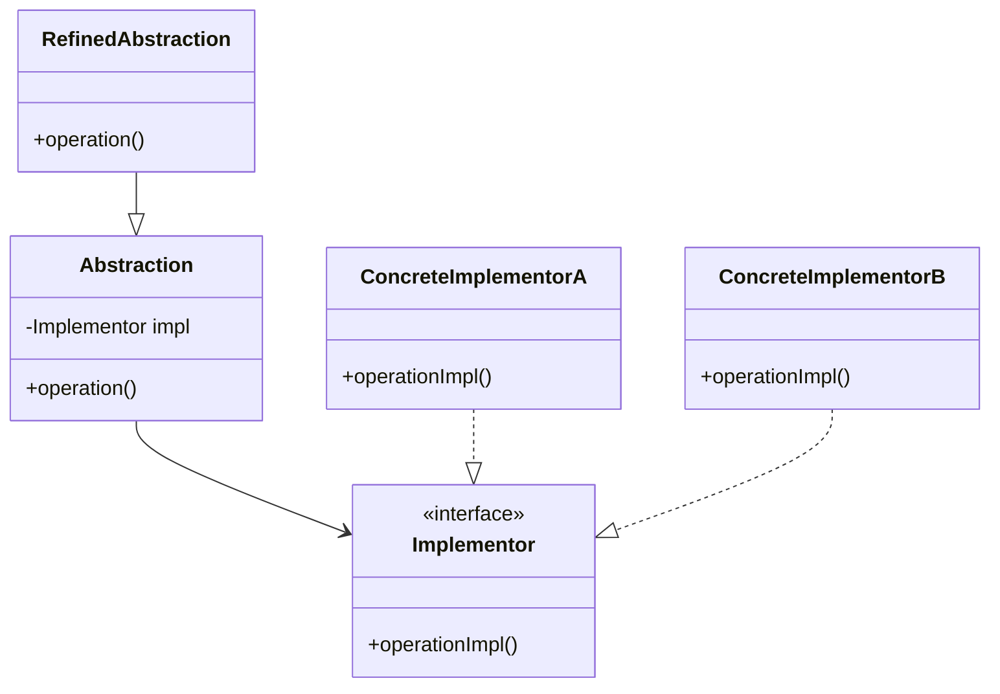

## 桥接模式

桥接模式是一种结构型设计模式，简单来说就是把抽象和实现分开来的方法，让他们可以独自变化。

在实际开发中，我们经常会遇到这样的问题：一个功能模块，既要支持多个平台，又要支持多种操作方式。比如做一个消息通知系统，你可以能叫支持 “邮箱通知、短信通知、微信通知”，又要支持 “普通用户、VIP 用户、企业用户” 的各种业务逻辑。这两个维度一交叉，代码量直接炸裂，继承结果也一眼看不到头。

桥接模式的作用，就是把 “消息类型” 这条线和 “用户类型” 这条线拆开，不再死绑在一起，而是通过抽象接口桥接起来。这样我们想加一种新消息、新用户，只管在自己的维度扩展就行了，不用去动对方的代码，灵活又清晰。

生活中也有很多类似的情况，比如买手机。我买了部手机，本身是华为品牌，但可以用移动、联通或者电信的卡。手机和运营商这两个东西，其实是两个互不影响的系统，如果硬要为 “华为+移动”、“苹果+联通”、“小米+电信” 都各自创造一款手机的话，生产线直接起飞。而现实中我们只需要加一个卡槽，两边标准化，谁都能插入，互相独立又可以自由组合，这个就是桥接模式的思想。

通俗来说，桥接模式就是在两个可能独立变化的部分添加一座桥，让他们灵活组合，而不是死死绑定。

## 为什么要使用桥接模式？

当一个系统中，抽象和实现之间都可能频繁变化，而且两者都存在多种可能性组合的时候，直接通过继承关系硬连接在一起会非常糟糕。继承会导致数量过多，灵活性变差，任何一方变化都得连续修改，出错率高。桥接模式通过把抽象和实现解耦，只用组合的方式关联，避免继承导致的僵硬结构，系统的扩展性、维护性都会大大提高。特别是面对多维变化的复杂系统时，桥接模式几乎是必选的解决方案。

## 桥接模式的应用场景

- 支付系统：在电商平台中，不同的支付方式（支付宝、微信支付、银行卡支付）通常有不同的实现逻辑。通过桥接模式，可以将支付接口与支付方式分开，使得支付系统可以在不修改业务逻辑的情况下，灵活的添加新的支付方式，同时也保持原有的支付方式的稳定性。
- 多渠道广告系统：在一个广告的发布平台中，可能需要支持不同的广告投放渠道（比如电视、互联网、户外广告等）。桥接模式可以将广告的具体展示与不同广告渠道的实现分开，使得增加或修改广告渠道时，系统的其他部分不受影响，提升系统的扩展性和维护性。
- 消息推送系统扩展：在一个支持多平台（如邮件、短信、微信）的消息推送系统中，不同的消息类型（如普通通知，告警通知）和放松渠道可能任意组合。使用桥接模式，我们可以将 “消息类型” 和 “发送渠道” 解耦，避免类数量过多，并实现任意组合的灵活扩展。

## 桥接模式的基本结构

1）抽象化：定义抽象接口，同时维护一个对实现对象的引用。

2）扩展抽象化：在抽象化基础上扩展，调用实现化对象的方法，增加新的功能。

3）实现化：定义实现化角色的接口，它不需要与抽象化接口完全一样，但一般要提供基本操作。

4）具体实现化：真正去实现化接口的类，完成具体的业务逻辑。

## 桥接模式的实现：

下面以 “消息推送系统” 为例，我们使用桥接模式实现一个灵活扩展的消息系统。

1）定义发送渠道接口：表示消息发送的底层实现渠道。

```java
public interface MessageSender {
    void send(String message);
}
```


2）实现不同的发送渠道：封装具体发送逻辑。

```java
public class EmailSender implements MessageSender {
    public void send(String message) {
        System.out.println("通过【邮件】发送消息：" + message);
    }
}

public class SMSSender implements MessageSender {
    public void send(String message) {
        System.out.println("通过【短信】发送消息：" + message);
    }
}

public class WeChatSender implements MessageSender {
    public void send(String message) {
        System.out.println("通过【微信】发送消息：" + message);
    }
}
```

这些类是桥接模式中 “实现者具体实现”，它们实现了消息的发送细节。我们可以随时添加新渠道而不懂原有结构。

3）定义抽象消息类：对外提供发送消息的统一入口。

```java
public abstract class Message {
    protected MessageSender sender;

    public Message(MessageSender sender) {
        this.sender = sender;
    }

    public abstract void send(String content);
}
```

这一步是桥接模式中的 “抽象类” 角色，它持有 MessageSender 的引用，实现从抽象到实现的 “桥接”，从而可以在运行时自由组合。

4）实现不同的消息类型：定义业务维度的扩展。

```java
public class NormalMessage extends Message {
    public NormalMessage(MessageSender sender) {
        super(sender);
    }

    public void send(String content) {
        System.out.println("【普通通知】开始发送...");
        sender.send(content);
    }
}

public class UrgentMessage extends Message {
    public UrgentMessage(MessageSender sender) {
        super(sender);
    }

    public void send(String content) {
        System.out.println("【紧急告警】开始发送...");
        sender.send("【加急】" + content);
    }
}
```

这一步市桥接模式中的 “扩展抽象类”，它定义了各种业务逻辑下的消息发送行为，比如普通消息、紧急消息等，而每种都可以桥接任意发送方式。

5）客户端调用示例：组合不同类型和渠道，灵活发送。

```java
public class Client {
    public static void main(String[] args) {
        MessageSender emailSender = new EmailSender();
        MessageSender smsSender = new SMSSender();
        MessageSender weChatSender = new WeChatSender();

        Message normalMsgViaEmail = new NormalMessage(emailSender);
        Message urgentMsgViaSMS = new UrgentMessage(smsSender);
        Message urgentMsgViaWeChat = new UrgentMessage(weChatSender);

        normalMsgViaEmail.send("欢迎使用我们的系统！");
        urgentMsgViaSMS.send("服务器 CPU 负载率过高！");
        urgentMsgViaWeChat.send("数据库连接异常！");
    }
}
```


通过桥接模式，我们实现了 “消息种类” 和 “发送方式“ 的解耦，它们可以自由组合，避免为每种组合都写一个类的灾难。这种设计非常适合多维度扩展的业务场景。

## 桥接模式的优缺点

#### 优点：

- 解耦抽象和实现：桥接模式通过将抽象部分和实现部分分离开来，使得他们可以独立变化，改变其实现类，反之亦然。这样减少了修改和扩展时的相互依赖。
- 提高系统的灵活性：由于抽象和实现是分开的，可以根据需要组合不同的抽象和实现，灵活性较高。这对于功能和实现不断变化的系统特别有用。
- 符合开闭原则：通过使用桥接模式，系统可以在不修改现有代码的基础上，灵活地增加新的抽象层和实现层，符合开闭原则，便于扩展。

#### 缺点：

- 增加了系统复杂度：桥接模式需要引入多个类，增加了类的数量，这可能会使系统的结构更加复杂，理解和维护起来较为困难，尤其是在初期设计阶段。
- 实现层的独立性问题：虽然抽象和实现分离了，但有时候，过于独立的实现层可能会导致难以管理的依赖关系。如果设计不当，可能会造成冗余代码或不必要的复杂性。
- 不适合简单场景：对于那些抽象和实现之间变化不大的简单场景，使用桥接模式可能会显得过于复杂和冗余。此时，直接将抽象和实现合并在一起可能会更加高效和直观。


---


## AI 扩展

# 桥接模式（Bridge Pattern）

## 1. 概念
桥接模式（Bridge Pattern）是一种结构型设计模式，它的核心思想是：

> **将抽象部分与实现部分分离，使它们都可以独立变化。**

简单来说：
- 抽象层负责定义业务逻辑
- 实现层负责具体实现
- 两者通过“桥”进行连接

这样可以避免类层次爆炸，提高系统扩展性。

---

## 2. 为什么需要桥接模式

假设有：

- 图形：圆形、矩形
- 颜色：红色、蓝色

如果使用继承：

红色圆形
蓝色圆形
红色矩形
蓝色矩形随着维度增加，类会越来越多。

桥接模式可以把：

- “图形”
- “颜色”

拆成两个独立维度进行组合。

------

## 3. 核心思想

桥接模式的关键：

```text
抽象 与 实现 解耦
```

通过组合代替继承。

------

## 4. 适用场景

适用于：

- 一个类存在两个独立变化的维度
- 不希望因为多层继承导致类爆炸
- 需要提高系统扩展性

例如：

| 场景       | 两个维度              |
| ---------- | --------------------- |
| 图形系统   | 图形 + 颜色           |
| 消息通知   | 消息类型 + 发送方式   |
| 数据库驱动 | 数据库类型 + 操作接口 |

------

## 5. 角色组成

| 角色                | 说明       |
| ------------------- | ---------- |
| Abstraction         | 抽象类     |
| RefinedAbstraction  | 扩展抽象类 |
| Implementor         | 实现接口   |
| ConcreteImplementor | 具体实现类 |

------

## 6. UML 类图



------

## 7. 示例代码（Java）

## 场景：图形 + 颜色

------

### 7.1 实现部分（颜色）

```java
interface Color {
    void applyColor();
}

class RedColor implements Color {
    @Override
    public void applyColor() {
        System.out.println("红色");
    }
}

class BlueColor implements Color {
    @Override
    public void applyColor() {
        System.out.println("蓝色");
    }
}
```

------

### 7.2 抽象部分（图形）

```java
abstract class Shape {
    protected Color color;

    public Shape(Color color) {
        this.color = color;
    }

    abstract void draw();
}
```

------

### 7.3 扩展抽象类

```java
class Circle extends Shape {

    public Circle(Color color) {
        super(color);
    }

    @Override
    void draw() {
        System.out.print("绘制圆形，颜色为：");
        color.applyColor();
    }
}

class Rectangle extends Shape {

    public Rectangle(Color color) {
        super(color);
    }

    @Override
    void draw() {
        System.out.print("绘制矩形，颜色为：");
        color.applyColor();
    }
}
```

------

### 7.4 客户端调用

```java
public class Client {
    public static void main(String[] args) {

        Shape redCircle = new Circle(new RedColor());
        Shape blueRectangle = new Rectangle(new BlueColor());

        redCircle.draw();
        blueRectangle.draw();
    }
}
```

------

## 8. 输出结果

```text
绘制圆形，颜色为：红色
绘制矩形，颜色为：蓝色
```

------

## 9. 桥接模式的优点

### （1）避免类爆炸

如果不用桥接：

```text
RedCircle
BlueCircle
GreenCircle
RedRectangle
BlueRectangle
...
```

桥接模式可以自由组合。

------

### （2）符合开闭原则

新增颜色：

```text
GreenColor
```

无需修改图形类。

新增图形：

```text
Triangle
```

无需修改颜色类。

------

### （3）提高扩展性

抽象层和实现层都可以独立扩展。

------

## 10. 缺点

- 增加系统理解难度
- 需要提前识别系统中独立变化的维度

------

## 11. 桥接模式 vs 适配器模式

| 对比     | 桥接模式       | 适配器模式     |
| -------- | -------------- | -------------- |
| 目的     | 分离抽象与实现 | 兼容不同接口   |
| 重点     | 解耦           | 转换接口       |
| 使用时机 | 系统设计阶段   | 系统已有后兼容 |
| 核心方式 | 组合           | 包装转换       |

------

## 12. 总结

桥接模式：

```text
不是为了兼容，
而是为了分离。
```

它通过：

```text
抽象部分 + 实现部分
```

进行解耦，使系统：

- 更灵活
- 更容易扩展
- 避免继承层级爆炸

属于非常经典的结构型设计模式。